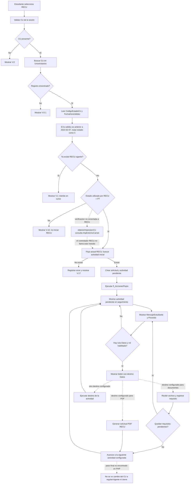

# Informe técnico del proceso RECU

**Proceso:** `RECU` — Regularización de Carné Universitario  
**Alcance:** comportamiento de `RECU` en el código PHP y campos de base de datos que participan en su flujo.  
**Objetivo funcional informado:** subsanar documentos faltantes o incorrectos que ya fueron presentados, completar el expediente y regularizar el carné provisional.

## 1. Resumen general

`RECU` se implementa dentro del módulo general de trámites; no tiene un controlador o servicio exclusivo. Su funcionamiento se compone de:

- Una validación de entrada en `DefaultController` que permite iniciar `RECU` cuando el CU existe, no tiene otro `RECU` vigente y su estado utilizado por la validación es provisional (`P`).
- La creación de una solicitud en `FL_TramitesPersonas` y una actividad inicial en `FL_ActividadesTramitesPersonas`.
- El avance mediante el motor genérico `fl_AccionesFlujos`.
- Un tablero que muestra el estado de la actividad, la retroalimentación asociada y, si corresponde al rol, el botón de acción cuyo destino proviene de `FL_ProcesosActividades.Datos`.
- Una acción genérica de carga documental que puede procesar `RECU` cuando el flujo y los requisitos están configurados para dirigirlo allí.
- Una acción específica `RECU` que genera una solicitud PDF y trata de avanzar la actividad pendiente.

**Recorrido comprobable en el código:** catálogo → validación de CU provisional → creación de `RECU` y actividad inicial → avance del motor → actividad pendiente mostrada en el tablero → mensaje de la actividad y destino del botón. La secuencia concreta posterior a la actividad inicial se define en la configuración de base de datos.

**Verificación de `ImpEntUnivCarnet`:** existe el método `TramitesDao::obtenerImpresionCU($cu)`, que consulta registros de autorización de impresión vigentes, marcados para imprimir, con observación de carné nuevo y sin `FechaHoraImpresion`. Sin embargo, `DefaultController::actionValidarTramite()` no llama a ese método dentro de la rama `RECU`. Después de validar que el estado usado sea `P`, `RECU` pasa directamente a buscar su actividad inicial. Por tanto, esa consulta existe en el proyecto, pero no condiciona actualmente el ingreso a `RECU`.

**Hasta dónde llega lo implementado:** el código valida e inicia el trámite, muestra las actividades y retroalimentación configuradas, dispone de carga documental genérica y genera un PDF específico de `RECU`. No aparece en el PHP revisado una transición que compruebe la condición requerida en `ImpEntUnivCarnet` antes de crear `RECU`, ni un paso que, al aprobar los documentos corregidos, actualice `Universitarios.CodigoEstadoCU` de `P` a regular/vigente y cierre el trámite.

## 2. Retroalimentación de Servicios Académicos

Según el comportamiento informado, Servicios Académicos revisa los documentos presentados y deja esta retroalimentación para el estudiante que tiene documentación pendiente:

> Señor universitario, su carné universitario no fue impreso por falta de documentación, favor comunicarse al 78662044 o apersonarse por Servicios Académicos.

Ese texto no aparece literalmente en los archivos PHP revisados. El tablero recibe y presenta información dinámica de la actividad:

- `FL_ProcesosActividades.MensajeEstudiante`: mensaje asociado a la configuración de la actividad.
- `FL_ActividadesTramitesPersonas.Proveido`: texto guardado en el registro de la actividad del trámite.

`siteDAO::obtenerMisTramites()` recupera ambos campos. `views/site/index.php` muestra el mensaje de estudiante en la alerta de acción requerida y coloca `Proveido` debajo. Así llega al seguimiento la retroalimentación que Servicios Académicos registra para el trámite. El PHP revisado no contiene la frase literal; el texto concreto llega como dato de la actividad o del registro de actividad, y sin consultar la fila de `RECU` no se puede afirmar en cuál de los dos campos está guardado.

La alerta se presenta cuando el trámite tiene una actividad pendiente (`CodigoEstado = 'P'`). Si `MensajeEstudiante` está vacío, `siteDAO::formatearTramites()` pone el texto genérico `Espere, el trámite se está procesando.`; el `Proveido` de la actividad se presenta en una línea aparte. Por tanto, la frase específica de falta de documentación aparece cuando está almacenada en uno de esos campos para la actividad del trámite. No es el mensaje inicial `V.10`, que aparece antes de crear el trámite cuando el estado usado por `RECU` no es `P`.

## 3. Componentes que intervienen

| Componente | Función dentro del recorrido `RECU` |
|---|---|
| [DefaultController.php](../modules/Tramites/controllers/DefaultController.php) | Publica procesos habilitados, valida la entrada y crea el trámite `RECU`. |
| [FLTramitesPersonas.php](../modules/Tramites/models/FLTramitesPersonas.php) | Modelo de la solicitud registrada. |
| [FLActividadesTramitesPersonas.php](../modules/Tramites/models/FLActividadesTramitesPersonas.php) | Modelo de las actividades y llamada para avanzar el flujo. |
| [FLProcesosActividades.php](../modules/Tramites/models/FLProcesosActividades.php) | Modelo de configuración: actividad, ruta del botón, mensaje y siguientes actividades. |
| [siteDAO.php](../models/siteDAO.php) | Recupera la actividad, sus mensajes y el destino que verá el usuario. |
| [index.php](../views/site/index.php) | Presenta el seguimiento, el mensaje de actividad y el botón de acción. |
| [TramitesController.php](../modules/Tramites/controllers/TramitesController.php) | Contiene las acciones genéricas de documentos y la generación específica del PDF `RECU`. |
| [TramitesDao.php](../modules/Tramites/models/TramitesDao.php) | Busca requisitos, registra archivos y avanza si ya no quedan requisitos pendientes. |
| [FLTramitesRequisitosPersonas.php](../modules/Tramites/models/FLTramitesRequisitosPersonas.php) | Modelo que valida y registra los archivos asociados al trámite. |
| [_solicitudCUVigente.php](../modules/Tramites/views/tramites/_solicitudCUVigente.php) | Plantilla del PDF de solicitud de carné regular para `RECU`. |

## 4. Inicio y validaciones de RECU

### 4.1 Entrada desde el catálogo

`DefaultController::actionIndex()` obtiene los procesos vigentes y habilitados desde `FL_Procesos`. La vista dirige la selección de `RECU` a `DefaultController::actionValidarTramite()` con `codigoProceso = RECU` e `inicio = 1`.

### 4.2 Validaciones

En [DefaultController.php](../modules/Tramites/controllers/DefaultController.php#L145), el controlador:

1. Obtiene el CU y la persona desde la identidad de la sesión.
2. Si el CU está vacío, muestra `V.0`.
3. Busca el registro en `Universitarios`; si no existe, muestra `V.0.1`.
4. Lee `CodigoEstadoCU`. Si `FechaHoraValidez` es anterior al 7 de febrero de 2022, el estado utilizado por esta validación se fuerza a `C`.
5. Busca un trámite vigente para el mismo CU y código `RECU`; si existe, impide iniciar otro.
6. Para `RECU`, solo permite avanzar si el estado utilizado es `P`.
7. Si el estado es `P`, busca la actividad inicial de `RECU` y continúa con la creación. En esta rama no invoca `TramitesDao::obtenerImpresionCU()` ni consulta `ImpEntUnivCarnet`.

La validación de entrada no identifica cuáles documentos faltan o fueron observados. La retroalimentación documental aparece en el seguimiento de la actividad del trámite.

### Verificación de impresión que existe en el código

`TramitesDao::obtenerImpresionCU($cu)` en [TramitesDao.php](../modules/Tramites/models/TramitesDao.php#L790) consulta `ImpEntUnivCarnet` por CU y filtra por `Observaciones` que contiene `Nuevo`, `FechaHoraImpresion IS NULL`, `Imprimir = 1` y `EsVigente = 1`. El método devuelve las filas que cumplen esas condiciones.

El método sí está llamado desde otra rama de `DefaultController::actionValidarTramite()`, pero no desde la rama `RECU`. Para `RECU`, la comprobación de estado `P` no va seguida por esa consulta. Según la regla de negocio indicada para el proceso, la verificación de `ImpEntUnivCarnet` debería ocurrir antes de permitir el ingreso; ese enlace no está presente en el código actual.

### 4.3 Mensajes de entrada e inicio

| Código | Condición | Mensaje |
|---|---|---|
| `V.0` | El CU de la sesión está vacío. | `No se encontró un CU válido.` |
| `V.0.1` | No existe el registro universitario para el CU. | `No se encontró registro del universitario.` |
| `V.1` | Ya existe un `RECU` vigente para ese CU. | `Este trámite ya se encuentra en curso. Revise el seguimiento a trámites en el SUNIVER.` |
| `V.10` | El estado utilizado por `RECU` no es `P`. | `SU CARNÉ UNIVERSITARIO NO ES PROVICIONAL, NO PUEDE RELIZAR EL TRÁMITE DE REGULARIZACIÓN.` |
| `V.12` | El método de inicio devuelve un resultado no falso. | `Su solicitud se está procesando. Será redirigido a la lista de pendientes.` |
| `V.17` | No se registra la solicitud o falta la actividad inicial. | `Error interno: No se pudo registrar su solicitud.` |
| `[1]` | No se pudo avanzar la actividad al generar el PDF. | `Error: Hubo problemas en avanzar flujo. ID Tramite = …` |

## 5. Creación y ejecución del flujo

`DefaultController::iniciarTramite()` busca en `FL_ProcesosActividades` la actividad de `RECU` cuyo `TipoActividad = 1`. Con esa actividad:

- Inserta una fila en `FL_TramitesPersonas`, asociada al CU y a la persona, en estado `V`; el valor inicial de `CostoTramite` se asigna a `0`.
- Inserta una fila en `FL_ActividadesTramitesPersonas` con la actividad inicial y estado pendiente `P`.
- Llama a `FLActividadesTramitesPersonas::avanzarFlujo()`, que ejecuta el procedimiento `fl_AccionesFlujos`.

La actividad siguiente no está codificada como una secuencia fija dentro de `DefaultController`; el motor obtiene las transiciones de la configuración del proceso.

### Diagrama de RECU



Las rutas de documentos, PDF u otra acción dependen de `FL_ProcesosActividades.Datos`. El tramo sólido después del estado `P` muestra el flujo actual. El tramo punteado hacia `ImpEntUnivCarnet` muestra una consulta existente en el proyecto pero no conectada al ingreso de `RECU`.

## 6. Mensaje de seguimiento y acción de Servicios Académicos

`siteDAO::obtenerMisTramites()` consulta las actividades del trámite y recupera `MensajeEstudiante`, `Proveido`, `Datos`, `EtiquetaBoton`, el estado y el rol asociado. El tablero presenta el bloque “Acción requerida para continuar” cuando la actividad está pendiente (`P`). Dentro del bloque muestra `MensajeEstudiante` y, debajo, `Proveido`.

El botón se construye con la ruta `Datos` de la actividad. `siteDAO::formatearTramites()` lo genera cuando la actividad está pendiente, `Datos` contiene una ruta y el rol actual coincide con el rol asignado. Por eso, la retroalimentación documental puede mostrarse como parte del seguimiento mientras el destino del botón conduce al paso de corrección configurado.

La frase de falta de documentación indicada en la sección 2 no está fija en el PHP. El código que se revisó transporta y muestra los campos dinámicos; el valor concreto se encuentra en el registro de actividad configurado o en el registro de actividad del trámite.

## 7. Carga y subsanación documental

La acción genérica `TramitesController::actionSubirDocumentos($codigoProceso, $idTramite)` delega en `TramitesDao::procesarSubidaDocumentos()` y muestra la vista `subirDocumentos.php`.

El DAO:

- Obtiene el trámite y una actividad pendiente.
- Consulta `FL_ActividadesRequisitos`, `FL_Requisitos` y `FL_RequisitosTiposArchivos` para recuperar requisitos del proceso.
- En una petición con archivo, registra el documento en `FL_TramitesRequisitosPersonas` y guarda el fichero en `pathDocTemp`.
- Busca si quedan requisitos pendientes de revisión de ventanilla.
- Si no encuentra requisitos pendientes y hay actividad pendiente, intenta avanzar el flujo.

El modelo de documentos conserva el nombre del archivo, requisito, foja y datos de verificación por persona/ventanilla. En el escenario normal valida archivos JPG/JPEG de hasta 2 MB y al menos 10 bytes.

La acción es genérica y acepta el código de proceso como parámetro. El PHP revisado no contiene una llamada exclusiva de `RECU` a esa acción; el destino y los requisitos llegan por la configuración del flujo y las tablas de requisitos.

## 8. Solicitud PDF de RECU

`TramitesController::actionImprimirSolicitud()` contiene un caso `RECU`. Genera un PDF con la vista `_solicitudCUVigente.php`, cuya carta solicita emitir el carné regular y expresa que el estudiante se inscribió provisionalmente y cuenta con diploma de bachiller. Después busca la actividad pendiente y llama a `avanzarFlujo()`.

La acción genera la carta y avanza una actividad. En esa rama no se registra la retroalimentación documental, no se valida el diploma y no se actualiza `Universitarios.CodigoEstadoCU`.

## 9. Estado final que muestra el código

**Implementado:** validación de CU provisional, prevención de `RECU` vigente duplicado, creación del trámite y actividad, avance del motor configurable, visualización del mensaje/observación de la actividad, destino de acción configurable, cargador documental genérico y generación de carta PDF `RECU`.

**No encontrado en el PHP revisado:** una regla específica que una automáticamente la observación de Servicios Académicos con los requisitos de `RECU`; una transición final que actualice el estado del CU a regular/vigente al aceptar los documentos; y una operación explícita que cierre `RECU` como resultado de esa actualización.

**Brecha específica de ingreso:** aunque hay un método que consulta `ImpEntUnivCarnet`, `DefaultController` no lo ejecuta para `RECU`. El flujo actual decide el ingreso por la existencia del CU, la ausencia de otro `RECU` vigente y el estado `P`; no aplica la verificación de impresión como condición adicional.

## 10. Consultas SQL de RECU

### FL_Procesos

```sql
SELECT
    CodigoProceso,
    NombreProceso,
    Descripcion,
    CodigoEstado,
    IniciaDesdeTramite
FROM dbo.FL_Procesos
WHERE CodigoProceso = 'RECU';
```

### FL_ProcesosActividades

```sql
SELECT
    pa.CodigoProceso,
    pa.IdActividad,
    pa.Actividad,
    pa.TipoActividad,
    pa.CodigoEstado,
    pa.Datos,
    pa.EtiquetaBoton,
    pa.MensajeEstudiante,
    pa.IdActividadSiguientes,
    pa.IdActividadAnteriores
FROM dbo.FL_ProcesosActividades AS pa
WHERE pa.CodigoProceso = 'RECU'
ORDER BY pa.IdActividad;
```

### FL_ActividadesRoles

```sql
SELECT
    ar.CodigoProceso,
    ar.IdActividad,
    pa.Actividad,
    ar.IdRol
FROM dbo.FL_ActividadesRoles AS ar
LEFT JOIN dbo.FL_ProcesosActividades AS pa
    ON pa.CodigoProceso = ar.CodigoProceso
   AND pa.IdActividad = ar.IdActividad
WHERE ar.CodigoProceso = 'RECU'
ORDER BY ar.IdActividad, ar.IdRol;
```

### FL_ActividadesRequisitos

```sql
SELECT
    ar.CodigoProceso,
    ar.IdActividad,
    pa.Actividad,
    ar.IdRequisito,
    r.Descripcion AS Requisito,
    ar.CodigoEstado AS EstadoAsignacion,
    r.CodigoEstado AS EstadoRequisito,
    ta.CodigoTipoArchivo,
    ta.Foja
FROM dbo.FL_ActividadesRequisitos AS ar
LEFT JOIN dbo.FL_ProcesosActividades AS pa
    ON pa.CodigoProceso = ar.CodigoProceso
   AND pa.IdActividad = ar.IdActividad
LEFT JOIN dbo.FL_Requisitos AS r
    ON r.IdRequisito = ar.IdRequisito
LEFT JOIN dbo.FL_RequisitosTiposArchivos AS ta
    ON ta.IdRequisito = ar.IdRequisito
WHERE ar.CodigoProceso = 'RECU'
ORDER BY ar.IdActividad, ar.IdRequisito, ta.Foja;
```

### FL_TramitesPersonas, FL_ActividadesTramitesPersonas y FL_ProcesosActividades

```sql
DECLARE @CU varchar(9) = 'REEMPLAZAR_CU';

SELECT
    tp.IdTramite,
    tp.CodigoProceso,
    tp.CodigoEstado AS EstadoTramite,
    tp.FechaHoraInicio,
    tp.FechaHoraFin,
    tp.CostoTramite,
    atp.IdActividad,
    pa.Actividad,
    atp.CodigoEstado AS EstadoActividad,
    atp.FechaHoraRecepcion,
    atp.FechaHoraDespacho,
    atp.Proveido,
    pa.MensajeEstudiante,
    pa.Datos,
    pa.EtiquetaBoton
FROM dbo.FL_TramitesPersonas AS tp
LEFT JOIN dbo.FL_ActividadesTramitesPersonas AS atp
    ON atp.IdTramite = tp.IdTramite
   AND atp.CodigoProceso = tp.CodigoProceso
LEFT JOIN dbo.FL_ProcesosActividades AS pa
    ON pa.CodigoProceso = atp.CodigoProceso
   AND pa.IdActividad = atp.IdActividad
WHERE tp.CU = @CU
  AND tp.CodigoProceso = 'RECU'
ORDER BY tp.IdTramite DESC, atp.FechaHoraRecepcion DESC;
```

### FL_TramitesRequisitosPersonas

```sql
DECLARE @IdTramite int = REEMPLAZAR_ID_TRAMITE;

SELECT
    trp.IdTramite,
    trp.IdRequisito,
    r.Descripcion AS Requisito,
    trp.NombreArchivo,
    trp.Foja,
    trp.FechaHoraRegistro,
    trp.VerificacionPersona,
    trp.FechaHoraVerificacionPersona,
    trp.VerificacionVentanilla,
    trp.CodigoUsuarioVentanilla,
    trp.FechaHoraVerificacionVentanilla
FROM dbo.FL_TramitesRequisitosPersonas AS trp
LEFT JOIN dbo.FL_Requisitos AS r
    ON r.IdRequisito = trp.IdRequisito
WHERE trp.IdTramite = @IdTramite
ORDER BY trp.IdRequisito, trp.Foja;
```

### Universitarios

```sql
DECLARE @CU varchar(9) = 'REEMPLAZAR_CU';

SELECT
    CU,
    CodigoEstadoCU,
    FechaHoraRegistro,
    FechaHoraValidez
FROM dbo.Universitarios
WHERE CU = @CU;
```

### ImpEntUnivCarnet

```sql
DECLARE @CU varchar(9) = 'REEMPLAZAR_CU';

SELECT
    CU,
    Observaciones,
    FechaHoraImpresion,
    Imprimir,
    EsVigente
FROM dbo.ImpEntUnivCarnet
WHERE CU = @CU
ORDER BY FechaHoraRegistroAutorizacion DESC;
```
