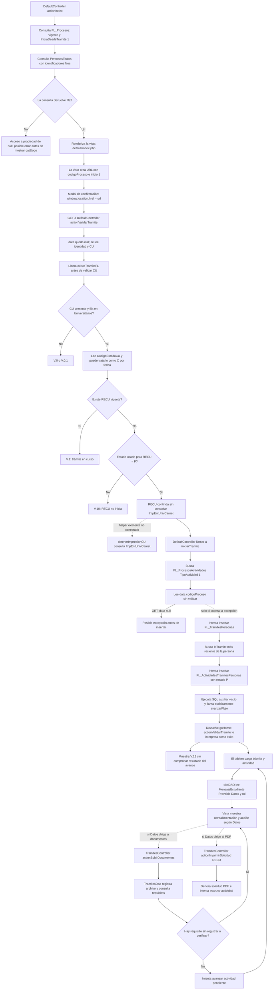

# RECU (Regularización de Carné Universitario): estado actual del código

**Proceso:** Regularización de Carné Universitario (`RECU`)  
**Alcance:** recorrido comprobable en el código PHP, tablas que el código consulta o modifica y riesgos observados. No se presupone el contenido de procedimientos almacenados ni de valores de configuración que no están en PHP.

**Propuesta de mejora relacionada:** [regularizacion-carnet-universitario-to-be.md](regularizacion-carnet-universitario-to-be.md).

## Glosario de siglas y componentes

| Nombre | Significado en estos informes |
|---|---|
| Estado actual (AS-IS) | Descripción del código que existe actualmente. |
| Estado objetivo propuesto (TO-BE) | Diseño propuesto; no describe comportamiento ya implementado. |
| Carné Universitario (CU) | Identificador/carné universitario de la persona en el sistema. |
| Regularización de Carné Universitario (RECU) | Código de proceso analizado en este informe. |
| Renovación de Carné Universitario (RCUN) | Nombre que el comentario del controlador asigna al código `RCUN`; se menciona aquí solo para ubicar el único llamado actual a `obtenerImpresionCU()`. |
| Certificación de Regularidad Académica Estudiantil (CRAE) | Nombre que aparece en la vista del certificado; `CRAE` es el código de ese proceso. |
| Copia legalizada (CLTD) | Código de proceso comentado en el código como trámite de copia legalizada. La expansión oficial de las letras `CLTD` no está declarada en PHP. |
| Contrato de Plan de Pagos de Matrícula (MCPP) | Nombre de la vista que el controlador asocia al código `MCPP`; el código no declara una expansión oficial letra por letra. |
| `RDMG` | Código que `DefaultController::actionIndex()` excluye de la consulta del catálogo. No se encontró su nombre completo en el flujo de `RECU`. |
| Módulo `Tramites` | Área Yii ubicada en `modules/Tramites`; agrupa controladores, modelos y vistas de trámites. |
| Controlador `DefaultController` | Clase PHP de `modules/Tramites/controllers/DefaultController.php`; contiene `actionValidarTramite()` e `iniciarTramite()`. No es una tabla. |
| Controlador `TramitesController` | Clase PHP de `modules/Tramites/controllers/TramitesController.php`; contiene acciones de documentos y generación del PDF. |
| Modelo ActiveRecord | Clase PHP que Yii usa para consultar o modificar una tabla. Ejemplo: `FLTramitesPersonas` es el modelo de la tabla `FL_TramitesPersonas`. |
| Prefijo `FL_` | Prefijo utilizado por las tablas de procesos y actividades del flujo. El código no declara su expansión oficial. |
| `FL_Procesos` / `FLProcesos` | Tabla de procesos / modelo PHP correspondiente. |
| `FL_ProcesosActividades` / `FLProcesosActividades` | Tabla de configuración de actividades / modelo PHP correspondiente. Contiene, entre otros datos, `Datos`, `MensajeEstudiante` y las actividades siguientes. |
| `FL_TramitesPersonas` / `FLTramitesPersonas` | Tabla de solicitudes de trámite / modelo PHP correspondiente. |
| `FL_ActividadesTramitesPersonas` / `FLActividadesTramitesPersonas` | Tabla de actividades de cada solicitud / modelo PHP correspondiente. |
| `FL_ActividadesRequisitos` | Tabla que relaciona requisitos con procesos y actividades. |
| `FL_TramitesRequisitosPersonas` | Tabla de archivos/requisitos presentados y su información de verificación. |
| `ImpEntUnivCarnet` | Tabla consultada por `obtenerImpresionCU()` para recuperar autorizaciones de impresión de carné. |
| `Universitarios` | Tabla/modelo con el CU y el estado `CodigoEstadoCU`. |
| `DefaultController` | Controlador que valida el inicio de `RECU`; cuando se menciona el módulo, se refiere a `modules/Tramites`. |
| `TramitesDao` | Clase de acceso a datos de trámites; `DAO` significa objeto de acceso a datos. |
| `siteDAO` | Clase que consulta y prepara la información de trámites para el tablero. |
| `fl_AccionesFlujos` | Procedimiento almacenado de base de datos invocado para avanzar/rechazar actividades. Su lógica interna no está en estos archivos PHP. |
| `GET` / `POST` | Métodos del protocolo HTTP: `GET` solicita una ruta/datos; `POST` envía datos de formulario. |
| `HTTP` | Protocolo de comunicación usado por solicitudes web. |
| `PHP` | Lenguaje en el que está escrita la aplicación revisada. |
| `SQL` | Lenguaje utilizado para consultar o modificar la base de datos. |
| `PDF` | Formato del documento generado por la acción de solicitud. |
| `Yii` | Framework PHP usado por la aplicación. |
| `IdPersona` / `IdTramite` / `IdActividad` | Identificadores de la persona, la solicitud y la actividad del flujo. |
| `CodigoProceso` | Campo que guarda el código del trámite, como `RECU`. |
| `TipoActividad` | Campo que identifica el tipo de actividad; `1` se busca como actividad inicial. |
| `CodigoEstadoCU` | Estado asociado al carné universitario; `P` se usa para provisional y la validación puede tratar una fecha antigua como `C` (caducado). |
| `NULL` | Valor de base de datos que representa ausencia de dato. |
| `Datos` | Campo de `FL_ProcesosActividades` que el tablero usa como destino del botón. |
| `MensajeEstudiante` | Campo de configuración de actividad que el tablero muestra como retroalimentación. |
| `Proveido` | Observación almacenada en la actividad concreta del trámite y mostrada en el seguimiento. |
| Estados `P`, `D`, `R`, `V` | Su significado depende del campo: para actividad, `P` pendiente, `D` despachada y `R` rechazada; en los trámites `V` indica vigente. Para `CodigoEstadoCU`, `P` se usa como provisional. |

**Cómo leer las referencias:** `FLTramitesPersonas` (sin guion bajo) nombra la clase PHP; `FL_TramitesPersonas` (con guion bajo) nombra la tabla. El controlador `DefaultController` está dentro del módulo `Tramites`; cuando una frase dice “el controlador consulta la tabla”, se refiere a la operación PHP sobre el objeto de base de datos, no a que la clase y la tabla sean lo mismo.

## Resumen

El catálogo del módulo `Tramites` conecta explícitamente con el método `actionValidarTramite()` del controlador `DefaultController`, ubicado en `modules/Tramites/controllers/DefaultController.php`, para el proceso Regularización de Carné Universitario (`RECU`). Esa acción valida la identidad, el Carné Universitario (`CU`), el estado provisional y la existencia de una solicitud duplicada; después intenta iniciar el trámite. Sin embargo, el enlace del catálogo utiliza el método HTTP `GET`, `$data` queda en `null` y `iniciarTramite()` accede a `$data["codigoProceso"]` sin comprobarlo. En la configuración habitual del framework Yii, esa advertencia se convierte en `yii\base\ErrorException`, por lo que el alta puede detenerse antes de guardar los registros.

Hay código para seguimiento, carga documental genérica y generación del PDF RECU. El código de seguimiento crea su botón a partir del valor dinámico `FL_ProcesosActividades.Datos`. No se encontró una ruta PHP fija que demuestre que las actividades RECU apunten a la carga genérica o al PDF. Para confirmarlo hace falta consultar la configuración de actividades en la base de datos.

## Secuencia actual

### Cómo leer el recorrido

`modules/Tramites` es el módulo Yii que organiza los trámites. Dentro de ese módulo, `DefaultController` es una clase PHP que atiende rutas web. `actionIndex()` y `actionValidarTramite()` son métodos públicos de esa clase que Yii publica como acciones. Por ejemplo, `/Tramites/default/index` llama a `DefaultController::actionIndex()` y `/Tramites/default/validar-tramite` llama a `DefaultController::actionValidarTramite()`.

La vista `modules/Tramites/views/default/index.php` dibuja la pantalla; no es el controlador. Las clases `FLProcesos` y `FLTramitesPersonas` son modelos PHP. Las tablas que esos modelos consultan se llaman `FL_Procesos` y `FL_TramitesPersonas`, respectivamente.

### 1. Catálogo y botón de inicio

#### Qué componente hace cada parte

1. **Módulo:** `modules/Tramites`.
2. **Controlador:** la clase PHP `DefaultController`, en `modules/Tramites/controllers/DefaultController.php`.
3. **Método que carga la pantalla:** `DefaultController::actionIndex()`. `actionIndex()` no es otro controlador ni otro módulo; es un método dentro de `DefaultController`.
4. **Modelo:** `FLProcesos`, que consulta la tabla `FL_Procesos`.
5. **Vista:** `modules/Tramites/views/default/index.php`, que recibe `$model` y dibuja las tarjetas de procesos.

#### Consulta de procesos que alimenta el catálogo

Dentro de `actionIndex()`, el controlador obtiene los procesos vigentes y habilitados para iniciarse desde trámites:

```php
$procesos = new FLProcesos();
$model = $procesos->find()
    ->where(['CodigoEstado' => 'V', 'IniciaDesdeTramite' => 1])
    ->andWhere("CodigoProceso <> 'RDMG'")
    ->all();
```

La vista recorre esos resultados. Para cada proceso, toma `CodigoProceso`; si no es la ruta especial de legalizaciones, asigna el destino `'/Tramites/default/validar-tramite'`. Como `RECU` se muestra a una identidad con CU, utiliza ese destino. El código crea la dirección con estos parámetros:

```php
$url = ($mostrarCLTDPersona)
    ? '/Tramites/legalizaciones/validar-tramite'
    : '/Tramites/default/validar-tramite';

$urlValidarTramite = Url::to([
    $url,
    'codigoProceso' => $codigoProceso,
    'inicio' => 1,
]);
```

La tarjeta guarda la dirección en `data-url`. Al pulsarla, el JavaScript de la misma vista abre el cuadro de confirmación; al confirmar ejecuta `window.location.href = url`:

```javascript
$('.confirmAction').on('click', function() {
    var url = $(this).data('url');
    $('#confirmBtn').off('click').on('click', function() {
        window.location.href = url;
    });
});
```

`window.location.href` navega a esa dirección mediante `GET`; esta vista no envía un formulario `POST`. Por tanto, para el proceso `RECU` la ruta que conecta el catálogo con la validación sí está construida: `/Tramites/default/validar-tramite?codigoProceso=RECU&inicio=1`.

#### Lectura adicional que ejecuta `actionIndex()`

Antes de renderizar el catálogo, el mismo método consulta `PersonasTitulos` con valores fijos y luego usa el resultado sin comprobar si la consulta devolvió una fila:

```php
$misTitulos = PersonasTitulos::find()->where([
    'IdPersona' => '10422119',
    'IdTitulo' => '5',
    'NumeroTitulo' => '14060',
])->one();

$Hash = md5(
    trim($misTitulos->CUPersonaTitulo) .
    trim($misTitulos->IdPersona) .
    trim($misTitulos->IdTitulo) .
    trim($misTitulos->NumeroTitulo) .
    trim($misTitulos->Resolucion) .
    trim($misTitulos->FechaEmision) .
    trim($misTitulos->FechaRegistro) .
    trim($misTitulos->FechaInsertado) .
    trim($misTitulos->Foja) .
    trim($misTitulos->Usuario) .
    trim($misTitulos->Observaciones) .
    trim($misTitulos->DenominacionTitulo)
);
```

El valor `$Hash` no se utiliza en los datos que se pasan a la vista. Si la consulta no encuentra esa fila, el acceso a `$misTitulos->CUPersonaTitulo` puede interrumpir `actionIndex()` antes de presentar el catálogo de `RECU`.

### 2. Validación de inicio

La URL del catálogo llega al método `actionValidarTramite()` de la clase `DefaultController`. Es una acción del controlador, no una llamada a otro módulo. La firma recibe `codigoProceso` como parámetro de ruta; para RECU su valor es `RECU`.

El inicio desde el catálogo es `GET`. Al principio de `actionValidarTramite()`, el controlador asigna `$data = null` cuando la petición no es `POST`, y obtiene CU/persona de la identidad autenticada:

```php
$data = Yii::$app->request->isPost
    ? Yii::$app->request->post()
    : null;

$identity = Yii::$app->user->identity;
$cu = $identity->CU ?? $identity->getId();
$idPersona = isset($identity->IdPersona)
    ? trim($identity->IdPersona)
    : null;
```

Después consulta `Universitarios` y calcula el estado que usará en las validaciones:

```php
$universitario = Universitarios::findOne($cu);
$estadoCU = $universitario->CodigoEstadoCU ?? '';

if (!empty($universitario->FechaHoraValidez)
    && strtotime($universitario->FechaHoraValidez) < strtotime('2022-02-07')) {
    $estadoCU = 'C';
}
```

La fecha anterior al 7 de febrero de 2022 hace que la variable local `$estadoCU` se trate como `C`, aunque el valor leído de `CodigoEstadoCU` sea otro. Esta asignación no actualiza la fila de `Universitarios`.

Al comienzo de `actionValidarTramite()`, antes de la condición que comprueba si `$cu` está vacío, el controlador llama a `Validaciones::existeTramiteFL($cu, $codigoProceso)` y guarda el resultado en `$existeTramite`. Después valida el CU y la fila universitaria. Más adelante, para un inicio `RECU`, si `$existeTramite` es verdadero se muestra `V.1` y se impide continuar.

`Validaciones::existeTramiteFL()` consulta la tabla `FL_TramitesPersonas` buscando el mismo CU/proceso con `CodigoEstado = 'V'`. La consulta actual concatena CU y código de proceso en la condición SQL:

```php
->where("CodigoEstado ='V'")
->andWhere("CU= ('".$cu."')")
->andWhere("codigoProceso= ('".$codigoProceso."')")
```

La acción impide crear otra solicitud si esa búsqueda encuentra un `RECU` vigente. La rama específica del proceso es:

```php
if ($codigoProceso == 'RECU') {
    if ($estadoCU != 'P') {
        $mensaje = Mensajeria::getHtmlError(
            "SU CARNÉ UNIVERSITARIO NO ES PROVICIONAL, " .
            "NO PUEDE RELIZAR EL TRÁMITE DE REGULARIZACIÓN. [V.10]"
        );
        $iniciarTramite = false;
    }
}
```

Por tanto, `V.10` es el mensaje inicial de `RECU` cuando el estado local no resulta `P`. En esa validación no se comprueba qué documento falta.

#### Consulta de impresión existente y conexión con RECU

El método PHP `TramitesDao::obtenerImpresionCU($cu)`, ubicado en `modules/Tramites/models/TramitesDao.php`, consulta la tabla `ImpEntUnivCarnet`. El fragmento de consulta es:

```php
$misTitulos = $connection->createCommand(
        "SELECT * FROM ImpEntUnivCarnet
         WHERE CU = :cu
             AND Observaciones LIKE '%Nuevo%'
             AND FechaHoraImpresion IS NULL
             AND Imprimir = 1
             AND EsVigente = 1",
        [':cu' => $cu]
)->queryAll();
```

El método devuelve las autorizaciones de impresión con observación de carné nuevo que siguen vigentes, marcadas para imprimir y sin fecha de impresión.

El llamado que se encontró a este helper está en `DefaultController::actionValidarTramite()`, dentro del bloque `codigoProceso == 'RCUN'` (Renovación de Carné Universitario):

```php
$misImpresiones = $tramitesDAO->obtenerImpresionCU($cu);
```

En el bloque siguiente, `codigoProceso == 'RECU'`, no aparece esa llamada. `RECU` valida el estado `P` y continúa buscando la actividad inicial. Por eso, aunque la consulta y el helper existen en el código, **no se ejecutan como prevalidación para permitir o impedir el ingreso a RECU**.

### 3. Alta y primer avance

Después de las validaciones, `actionValidarTramite()` llama a `iniciarTramite($codigoProceso, $idPersona, $cu, null, $data)`. Como la navegación viene por `GET`, `$data` se envía como `null`.

El método `iniciarTramite()` pertenece también a `DefaultController`. Primero busca en el modelo `FLProcesosActividades` una fila de la tabla `FL_ProcesosActividades` para el proceso y `TipoActividad = 1`:

```php
$model = (new FLProcesosActividades())
    ->find()
    ->where([
        'CodigoProceso' => $codigoProceso,
        'TipoActividad' => '1',
    ])
    ->one();
```

Si no encuentra esa fila, registra el error `No se encontró configuración de proceso ... con TipoActividad = '1'` y devuelve `false`; la acción muestra `V.17`.

**Fallo anterior a los `INSERT`:** antes de insertar la solicitud, el método contiene esta lectura de `$data` sin validar que no sea `null`:

```php
if ($data["codigoProceso"] == 'CRAE') {
    $motivo = RegularidadController::obtenerMotivo($data);
    $tramite->Observaciones = $motivo;
}
```

La condición no está limitada a `codigoProceso = CRAE` antes de leer el índice: evalúa `$data["codigoProceso"]` para cualquier proceso. Con el acceso normal por GET, `$data` es `null`; según la versión/configuración de PHP/Yii, esta lectura puede generar una advertencia convertida en excepción. Si eso ocurre, la ejecución se detiene aquí y no alcanza los `INSERT` siguientes.

Si la ejecución supera esa lectura, se intentan insertar estos registros:

```php
$tramite->CodigoProceso = $codigoProceso;
$tramite->IdPersona = (string) trim($idPersona);
$tramite->CU = $cu;
$tramite->CostoTramite = 0;
$tramite->CodigoEstado = 'V';
$tramite->Observaciones = 'Desde Suniver';
$tramite->CodigoUsuario = $codigoUsuario;
$tramite->insert();
```

Después se obtiene el identificador mediante `obtenerIdTramite($tramite, $idPersona)`, que busca el trámite más reciente de esa persona, y se intenta insertar la actividad inicial:

```php
$actividadesTramites->IdTramite = $idTramite;
$actividadesTramites->CodigoProceso = $codigoProceso;
$actividadesTramites->IdActividad = $model->IdActividad;
$actividadesTramites->Proveido = 'Desde SUNIVER';
$actividadesTramites->CodigoEstado = 'P';
$actividadesTramites->insert();
```

En este tramo, `FLTramitesPersonas` y `FLActividadesTramitesPersonas` son modelos PHP; los registros se escriben en las tablas `FL_TramitesPersonas` y `FL_ActividadesTramitesPersonas`.

Si la actividad se inserta, para `RECU` `$strSql` permanece vacío: el texto SQL auxiliar solo se completa en la rama del código de copia legalizada. Aun así, el método ejecuta `createCommand($strSql)->execute()` y después llama a `FLActividadesTramitesPersonas::avanzarFlujo()` de forma estática, aunque el método está declarado como método de instancia. En el entorno PHP 7.4.18 revisado, esa llamada se reportó como deprecada y continuó; el resultado no se comprueba.

El método termina devolviendo `$this->goHome()`. La acción exterior usa el valor devuelto como condición booleana: si es no falso, muestra `V.12` (“Su solicitud se está procesando”) y programa una redirección a `Yii::$app->homeUrl` en cuatro segundos. Por ello, `V.12` no demuestra por sí solo que el avance del flujo haya tenido éxito.

### 4. Seguimiento y botón de actividad

`SiteController::actionIndex()` llama a `siteDAO::obtenerMisTramites()` y `formatearTramites()`. La consulta vincula `FL_TramitesPersonas`, `FL_ActividadesTramitesPersonas`, `FL_ProcesosActividades` y `FL_ActividadesRoles`. El tablero muestra trámites cuyo registro tiene estado `V`; para actividades `P` elabora la alerta y, cuando coincide el rol, construye el botón a partir de `FL_ProcesosActividades.Datos`, pasando `codigoProceso`, `idTramite` e `idActividad`.

La consulta interpreta estado de actividad `P` como pendiente, `D` como despachado y `R` como rechazado. La vista dibuja un check para `D`. `MensajeEstudiante` y `Proveido` se presentan en el seguimiento. El texto específico que pudiera dejar Servicios Académicos no está literal en los PHP; si `MensajeEstudiante` está vacío, aparece “Espere, el trámite se está procesando”.

El modelo de requisitos incluye `VerificacionVentanilla`, `CodigoUsuarioVentanilla` y `FechaHoraVerificacionVentanilla`. El DAO de carga usa `VerificacionVentanilla` para decidir si un requisito sigue pendiente. Esto demuestra que el código considera un resultado de revisión de ventanilla, pero no identifica en esa ruta que el actor sea Servicios Académicos ni se encontró en los PHP revisados la acción que registre su aprobación o rechazo. La retroalimentación puede exponerse en `MensajeEstudiante` o `Proveido`; el código del tablero los lee, pero no define por sí mismo el contenido para RECU.

**Conexión no demostrada:** el destino real del botón RECU no está codificado en PHP. Se obtiene de `Datos` en la configuración de cada actividad; el repositorio por sí solo no demuestra si enlaza a subir documentos, al PDF o a otra acción.

### 5. Acción genérica de documentos

`TramitesController::actionSubirDocumentos($codigoProceso, $idTramite)` delega en `TramitesDao::procesarSubidaDocumentos()` y presenta la vista de carga. El DAO consulta o modifica `FL_TramitesPersonas`, `FL_ActividadesTramitesPersonas`, `FL_ActividadesRequisitos`, `FL_Requisitos`, `FL_RequisitosTiposArchivos` y `FL_TramitesRequisitosPersonas`. Guarda los archivos bajo `pathDocTemp`, registra requisito/foja/nombre y revisa si quedan requisitos sin registro o sin verificación de ventanilla. Si no quedan y hay actividad pendiente, solicita el avance.

La validación general del modelo admite archivos JPG/JPEG, hasta 2 MB y mínimo 10 bytes; para el código MCPP (asociado por el controlador a la vista Contrato de Plan de Pagos de Matrícula) se define un escenario PDF de hasta 5 MB. El código no declara la expansión oficial de las letras `MCPP`. La acción es genérica; no hay una condición PHP exclusiva para RECU ni una llamada fija desde el botón RECU.

En concreto, antes de procesar el POST, el DAO elimina registros del trámite con `VerificacionVentanilla = 0` cuando `CodigoUsuarioVentanilla` no es nulo. Luego busca requisitos sin registro o con `VerificacionVentanilla = 0`; si encuentra alguno no solicita avanzar. Si la consulta no devuelve pendientes y hay actividad `P`, intenta avanzar. El código usa el indicador como compuerta, pero la decisión y el registro del resultado de revisión no están implementados en esta acción.

### 6. Acción de solicitud PDF

`TramitesController::actionImprimirSolicitud($codigoProceso, $idTramite)` contiene un `case 'RECU'`. Usa `_solicitudCUVigente.php`, genera el documento “SOLICITUD CU VIGENTE”, busca una actividad pendiente y solicita avanzar mediante el método `avanzarFlujo()`. No hay una ruta fija en las vistas/controladores PHP que conecte RECU con esa acción; el enlace podría estar en `Datos`, pero debe confirmarse en la configuración. Esta rama no actualiza directamente `Universitarios.CodigoEstadoCU`.

## Otros riesgos del recorrido

| Hallazgo | Consecuencia posible |
|---|---|
| `DefaultController::actionIndex()` consulta `PersonasTitulos` con `IdPersona`, `IdTitulo` y `NumeroTitulo` fijos y usa el resultado sin comprobar que exista; el hash resultante no se usa. | El catálogo podría fallar antes de mostrar procesos, según la existencia de esa fila. |
| Acceso a `$data["codigoProceso"]` sin verificar `$data` en el inicio GET. | Excepción antes del alta de RECU. |
| `obtenerIdTramite()` vuelve a consultar el trámite más reciente de `IdPersona` después del `INSERT`, en vez de tomar la clave generada por el modelo recién insertado. | En solicitudes simultáneas de la misma persona podría asociarse la actividad inicial a otro `IdTramite`. |
| Llamada estática a método de instancia `avanzarFlujo()`. | Deprecated confirmado en PHP 7.4.18; compatibilidad depende de versión/configuración. |
| Se ignora el resultado de `avanzarFlujo()` y el helper retorna `goHome()`. | `V.12` puede no representar que el flujo avanzó. |
| La carga lee `VerificacionVentanilla`, pero no se localizó en PHP el escritor de esa decisión ni una asignación que identifique al actor como Servicios Académicos. | La aprobación/devolución se representa solo mediante los datos que la carga espera encontrar; falta localizar el módulo que registra la decisión para documentar el enlace completo. |
| No se encontró una escritura PHP a `Universitarios.CodigoEstadoCU` como parte de RECU. | La validación final/cambio del estado del CU no queda conectado a una acción RECU en el código revisado. |
| Las rutas de documentos/PDF dependen de `Datos`. | No se puede declarar que RECU está enlazado a esos controladores sin consultar las actividades configuradas. |

## Tablas y modelos alcanzados

| Punto | Modelo / tabla | Operación visible en PHP |
|---|---|---|
| Catálogo | `FLProcesos` / `FL_Procesos` | Lee procesos vigentes iniciables desde trámites. |
| Estado CU | `Universitarios` / `Universitarios` | Lee CU, `CodigoEstadoCU` y `FechaHoraValidez`. |
| Duplicidad | `Validaciones` y `FLTramitesPersonas` / `FL_TramitesPersonas` | Busca trámite vigente por CU y código de proceso. |
| Actividad de inicio | `FLProcesosActividades` / `FL_ProcesosActividades` | Busca proceso RECU con `TipoActividad = 1`. |
| Alta | `FLTramitesPersonas` / `FL_TramitesPersonas` | Intenta guardar datos generales del trámite. |
| Actividad | `FLActividadesTramitesPersonas` / `FL_ActividadesTramitesPersonas` | Intenta guardar actividad, estado y proveído; expone `avanzarFlujo()`. |
| Configuración de botón/rol | `FLProcesosActividades`, `FLActividadesRoles` / `FL_ProcesosActividades`, `FL_ActividadesRoles` | Lectura del destino, mensaje y rol para seguimiento. |
| Requisitos | `FLActividadesRequisitos`, `FLRequisitos`, `FLRequisitosTiposArchivos` | Consulta de requisitos y tipos/fojas para carga genérica. |
| Archivo | `FLTramitesRequisitosPersonas` / `FL_TramitesRequisitosPersonas` | Inserta metadatos del archivo y datos de verificación. |

## Consultas para verificar RECU

Estas consultas son de diagnóstico. Deben ejecutarse en un entorno autorizado. No alteran datos.

### Proceso visible en catálogo

```sql
SELECT CodigoProceso, NombreProceso, CodigoEstado, IniciaDesdeTramite
FROM dbo.FL_Procesos
WHERE CodigoProceso = 'RECU';
```

### Actividades y destinos configurados

Esta consulta permite confirmar a qué acciones llega cada botón. El contenido de `Datos` es el valor decisivo para verificar los enlaces no hardcodeados.

```sql
SELECT
    pa.CodigoProceso,
    pa.IdActividad,
    pa.Actividad,
    pa.TipoActividad,
    pa.CodigoEstado,
    pa.Datos,
    pa.EtiquetaBoton,
    pa.MensajeEstudiante,
    pa.IdActividadSiguientes,
    pa.IdActividadAnteriores,
    pa.CodigoTipoTransaccion
FROM dbo.FL_ProcesosActividades AS pa
WHERE pa.CodigoProceso = 'RECU'
ORDER BY pa.IdActividad;
```

### Roles de cada actividad

```sql
SELECT ar.CodigoProceso, ar.IdActividad, pa.Actividad, ar.IdRol
FROM dbo.FL_ActividadesRoles AS ar
LEFT JOIN dbo.FL_ProcesosActividades AS pa
    ON pa.CodigoProceso = ar.CodigoProceso
   AND pa.IdActividad = ar.IdActividad
WHERE ar.CodigoProceso = 'RECU'
ORDER BY ar.IdActividad, ar.IdRol;
```

### Requisitos por actividad y formato

```sql
SELECT
    ar.CodigoProceso,
    ar.IdActividad,
    pa.Actividad,
    ar.IdRequisito,
    r.Descripcion AS Requisito,
    ar.CodigoEstado AS EstadoAsignacion,
    r.CodigoEstado AS EstadoRequisito,
    ta.CodigoTipoArchivo,
    ta.Foja
FROM dbo.FL_ActividadesRequisitos AS ar
LEFT JOIN dbo.FL_ProcesosActividades AS pa
    ON pa.CodigoProceso = ar.CodigoProceso
   AND pa.IdActividad = ar.IdActividad
LEFT JOIN dbo.FL_Requisitos AS r
    ON r.IdRequisito = ar.IdRequisito
LEFT JOIN dbo.FL_RequisitosTiposArchivos AS ta
    ON ta.IdRequisito = ar.IdRequisito
WHERE ar.CodigoProceso = 'RECU'
ORDER BY ar.IdActividad, ar.IdRequisito, ta.Foja;
```

### Trámites y actividades existentes

```sql
DECLARE @CU varchar(20) = 'REEMPLAZAR_CU';

SELECT
    tp.IdTramite,
    tp.CodigoProceso,
    tp.CodigoEstado AS EstadoTramite,
    tp.IdPersona,
    tp.CU,
    tp.FechaHoraInicio,
    tp.FechaHoraFin,
    tp.CostoTramite,
    atp.IdActividad,
    pa.Actividad,
    atp.CodigoEstado AS EstadoActividad,
    atp.FechaHoraRecepcion,
    atp.FechaHoraDespacho,
    atp.Proveido,
    pa.MensajeEstudiante,
    pa.Datos
FROM dbo.FL_TramitesPersonas AS tp
LEFT JOIN dbo.FL_ActividadesTramitesPersonas AS atp
    ON atp.IdTramite = tp.IdTramite
   AND atp.CodigoProceso = tp.CodigoProceso
LEFT JOIN dbo.FL_ProcesosActividades AS pa
    ON pa.CodigoProceso = atp.CodigoProceso
   AND pa.IdActividad = atp.IdActividad
WHERE tp.CU = @CU
  AND tp.CodigoProceso = 'RECU'
ORDER BY tp.IdTramite DESC, atp.FechaHoraRecepcion DESC;
```

### Archivos/requisitos registrados en un trámite

```sql
DECLARE @IdTramite int = REEMPLAZAR_ID_TRAMITE;

SELECT
    trp.IdTramite,
    trp.IdRequisito,
    r.Descripcion AS Requisito,
    trp.NombreArchivo,
    trp.Foja,
    trp.FechaHoraRegistro,
    trp.VerificacionPersona,
    trp.FechaHoraVerificacionPersona,
    trp.VerificacionVentanilla,
    trp.CodigoUsuarioVentanilla,
    trp.FechaHoraVerificacionVentanilla
FROM dbo.FL_TramitesRequisitosPersonas AS trp
LEFT JOIN dbo.FL_Requisitos AS r ON r.IdRequisito = trp.IdRequisito
WHERE trp.IdTramite = @IdTramite
ORDER BY trp.IdRequisito, trp.Foja;
```

### Datos usados por la validación

```sql
DECLARE @CU varchar(20) = 'REEMPLAZAR_CU';

SELECT CU, CodigoEstadoCU, FechaHoraValidez
FROM dbo.Universitarios
WHERE CU = @CU;

SELECT IdTramite, CodigoProceso, CU, CodigoEstado, FechaHoraInicio, FechaHoraFin
FROM dbo.FL_TramitesPersonas
WHERE CU = @CU AND CodigoProceso = 'RECU'
ORDER BY IdTramite DESC;
```

### Consulta del helper obtenerImpresionCU

```sql
DECLARE @CU varchar(20) = 'REEMPLAZAR_CU';

SELECT *
FROM dbo.ImpEntUnivCarnet
WHERE CU = @CU
    AND Observaciones LIKE '%Nuevo%'
    AND FechaHoraImpresion IS NULL
    AND Imprimir = 1
    AND EsVigente = 1;
```

## Diagrama AS-IS



Las flechas continuas describen llamadas y decisiones del código PHP observado. Las discontinuas indican dos hechos distintos: la búsqueda de `ImpEntUnivCarnet` existe como helper, pero `RECU` no la llama; y las rutas a carga documental/PDF dependen de `FL_ProcesosActividades.Datos`. El diagrama no presenta el alta y el avance como exitosos: la ruta GET puede detenerse en la lectura de `$data["codigoProceso"]` antes del primer `INSERT`. Si supera ese punto, el resultado de `avanzarFlujo()` no se verifica en `iniciarTramite()`, y no aparece en el PHP una actualización final de `Universitarios.CodigoEstadoCU`.
