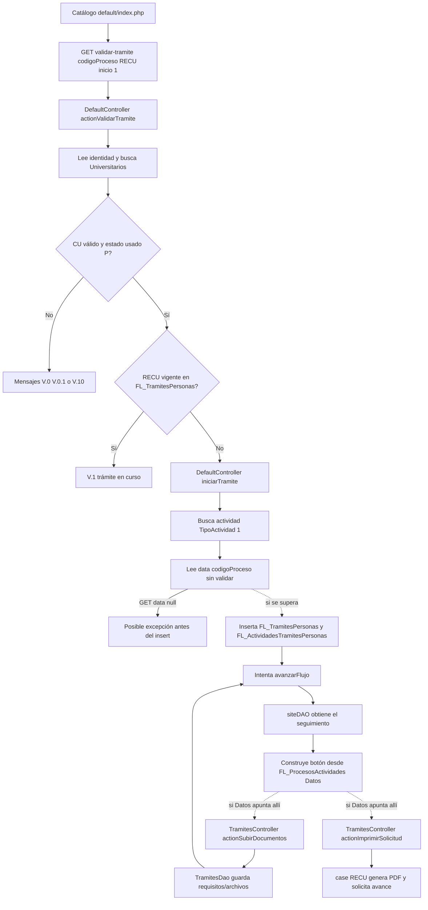

# RECU: estado actual del código (AS-IS)

**Proceso:** Regularización de Carné Universitario (`RECU`)  
**Alcance:** recorrido comprobable en el código PHP, tablas que el código consulta o modifica y riesgos observados. No se presupone el contenido de procedimientos almacenados ni de valores de configuración que no están en PHP.

**Propuesta de mejora relacionada:** [regularizacion-carnet-universitario-to-be.md](regularizacion-carnet-universitario-to-be.md).

## Resumen

El catálogo de trámites conecta explícitamente con `DefaultController::actionValidarTramite()` para el proceso `RECU`. Esa acción valida identidad, CU, estado provisional y duplicidad; después intenta iniciar el trámite. Sin embargo, el camino desde el catálogo es GET, `$data` queda en `null` y `iniciarTramite()` accede a `$data["codigoProceso"]` sin comprobarlo. En la configuración habitual de Yii, esa advertencia se convierte en `yii\base\ErrorException`, por lo que el alta puede detenerse antes de guardar los registros.

Hay código para seguimiento, carga documental genérica y generación del PDF RECU. El código de seguimiento crea su botón a partir del valor dinámico `FL_ProcesosActividades.Datos`. No se encontró una ruta PHP fija que demuestre que las actividades RECU apunten a la carga genérica o al PDF. Para confirmarlo hace falta consultar la configuración de actividades en la base de datos.

## Secuencia actual

### 1. Catálogo y botón de inicio

`DefaultController::actionIndex()` carga procesos desde `FL_Procesos`, filtrando `CodigoEstado = 'V'` e `IniciaDesdeTramite = 1`. La vista [modules/Tramites/views/default/index.php](../modules/Tramites/views/default/index.php) construye la URL `/Tramites/default/validar-tramite` con `codigoProceso=<código>` e `inicio=1`. El JavaScript de confirmación navega a esa URL. Para RECU, esta conexión a `actionValidarTramite()` está escrita en el código.

### 2. Validación de inicio

`DefaultController::actionValidarTramite()` lee el CU y `IdPersona` de la identidad autenticada. Busca el CU en `Universitarios` y toma `CodigoEstadoCU`; si `FechaHoraValidez` existe y es anterior a `2022-02-07`, sustituye el estado usado por `C`. Después consulta `Validaciones::existeTramiteFL()` para detectar una fila de `FL_TramitesPersonas` con el mismo CU/proceso y `CodigoEstado = 'V'`. Para `RECU` solo permite continuar cuando el estado usado es `P`.

Mensajes conocidos: `V.0` CU ausente; `V.0.1` no existe registro universitario; `V.1` ya hay trámite RECU vigente; `V.10` estado distinto de provisional; `V.12` solicitud indicada como procesándose; `V.17` error informado al registrar.

### 3. Alta y primer avance

`DefaultController::iniciarTramite()` busca la actividad inicial de `RECU` en `FL_ProcesosActividades`, con `TipoActividad = 1`. Si la encuentra, intenta insertar:

- En `FL_TramitesPersonas`: proceso, persona, CU, nivel/modalidad, `FechaHoraFin = NULL`, `CostoTramite = 0`, `CodigoEstado = 'V'`, observación `Desde Suniver` y usuario.
- En `FL_ActividadesTramitesPersonas`: trámite, proceso, actividad inicial, `FechaHoraDespacho = NULL`, proveído `Desde SUNIVER`, `CodigoEstado = 'P'` y usuario.

**Hallazgo que interrumpe la ruta GET:** antes de esos insert, el método evalúa `$data["codigoProceso"]` para el caso `CRAE`. El botón del catálogo no envía POST, por lo que `actionValidarTramite()` asigna `null` a `$data`. En el entorno comprobado (PHP 7.4.18 con Yii), el acceso a ese índice genera advertencia que Yii convierte en excepción. Así, la ruta normal puede detenerse antes de insertar el trámite o actividad.

Si se supera ese punto, el método ejecuta `$strSql`, que queda vacío para RECU (solo se llena para CLTD). Yii 2 devuelve `0` para SQL vacío y continúa. Luego llama estáticamente a `FLActividadesTramitesPersonas::avanzarFlujo()`, aunque el método está declarado como método de instancia. PHP 7.4.18 lo reporta como deprecado pero lo ejecuta; se debe verificar en la versión objetivo de producción. Además, no se evalúa el resultado de avance y `iniciarTramite()` devuelve `goHome()`, valor que puede hacer que la acción exterior muestre `V.12` sin confirmar el avance.

### 4. Seguimiento y botón de actividad

`SiteController::actionIndex()` llama a `siteDAO::obtenerMisTramites()` y `formatearTramites()`. La consulta vincula `FL_TramitesPersonas`, `FL_ActividadesTramitesPersonas`, `FL_ProcesosActividades` y `FL_ActividadesRoles`. El tablero muestra trámites cuyo registro tiene estado `V`; para actividades `P` elabora la alerta y, cuando coincide el rol, construye el botón a partir de `FL_ProcesosActividades.Datos`, pasando `codigoProceso`, `idTramite` e `idActividad`.

La consulta interpreta estado de actividad `P` como pendiente, `D` como despachado y `R` como rechazado. La vista dibuja un check para `D`. `MensajeEstudiante` y `Proveido` se presentan en el seguimiento. El texto específico que pudiera dejar Servicios Académicos no está literal en los PHP; si `MensajeEstudiante` está vacío, aparece “Espere, el trámite se está procesando”.

**Conexión no demostrada:** el destino real del botón RECU no está codificado en PHP. Se obtiene de `Datos` en la configuración de cada actividad; el repositorio por sí solo no demuestra si enlaza a subir documentos, al PDF o a otra acción.

### 5. Acción genérica de documentos

`TramitesController::actionSubirDocumentos($codigoProceso, $idTramite)` delega en `TramitesDao::procesarSubidaDocumentos()` y presenta la vista de carga. El DAO consulta o modifica `FL_TramitesPersonas`, `FL_ActividadesTramitesPersonas`, `FL_ActividadesRequisitos`, `FL_Requisitos`, `FL_RequisitosTiposArchivos` y `FL_TramitesRequisitosPersonas`. Guarda los archivos bajo `pathDocTemp`, registra requisito/foja/nombre y revisa si quedan requisitos sin registro o sin verificación de ventanilla. Si no quedan y hay actividad pendiente, solicita el avance.

La validación general del modelo admite JPG/JPEG, hasta 2 MB y mínimo 10 bytes; para el escenario `MCPP` se define PDF hasta 5 MB. La acción es genérica; no hay una condición PHP exclusiva para RECU ni una llamada fija desde el botón RECU.

### 6. Acción de solicitud PDF

`TramitesController::actionImprimirSolicitud($codigoProceso, $idTramite)` contiene un `case 'RECU'`. Usa `_solicitudCUVigente.php`, genera el documento “SOLICITUD CU VIGENTE”, busca una actividad pendiente y solicita avanzar mediante el método `avanzarFlujo()`. No hay una ruta fija en las vistas/controladores PHP que conecte RECU con esa acción; el enlace podría estar en `Datos`, pero debe confirmarse en la configuración. Esta rama no actualiza directamente `Universitarios.CodigoEstadoCU`.

## Otros riesgos del recorrido

| Hallazgo | Consecuencia posible |
|---|---|
| `DefaultController::actionIndex()` consulta `PersonasTitulos` con `IdPersona`, `IdTitulo` y `NumeroTitulo` fijos y usa el resultado sin comprobar que exista; el hash resultante no se usa. | El catálogo podría fallar antes de mostrar procesos, según la existencia de esa fila. |
| Acceso a `$data["codigoProceso"]` sin verificar `$data` en el inicio GET. | Excepción antes del alta de RECU. |
| Llamada estática a método de instancia `avanzarFlujo()`. | Deprecated confirmado en PHP 7.4.18; compatibilidad depende de versión/configuración. |
| Se ignora el resultado de `avanzarFlujo()` y el helper retorna `goHome()`. | `V.12` puede no representar que el flujo avanzó. |
| Las rutas de documentos/PDF dependen de `Datos`. | No se puede declarar que RECU está enlazado a esos controladores sin consultar las actividades configuradas. |

## Tablas y modelos alcanzados

| Punto | Modelo / tabla | Operación visible en PHP |
|---|---|---|
| Catálogo | `FLProcesos` / `FL_Procesos` | Lee procesos vigentes iniciables desde trámites. |
| Estado CU | `Universitarios` / `Universitarios` | Lee CU, `CodigoEstadoCU` y `FechaHoraValidez`. |
| Duplicidad | `Validaciones` y `FLTramitesPersonas` / `FL_TramitesPersonas` | Busca trámite vigente por CU y código de proceso. |
| Actividad de inicio | `FLProcesosActividades` / `FL_ProcesosActividades` | Busca proceso RECU con `TipoActividad = 1`. |
| Alta | `FLTramitesPersonas` / `FL_TramitesPersonas` | Intenta guardar datos generales del trámite. |
| Actividad | `FLActividadesTramitesPersonas` / `FL_ActividadesTramitesPersonas` | Intenta guardar actividad, estado y proveído; expone `avanzarFlujo()`. |
| Configuración de botón/rol | `FLProcesosActividades`, `FLActividadesRoles` / `FL_ProcesosActividades`, `FL_ActividadesRoles` | Lectura del destino, mensaje y rol para seguimiento. |
| Requisitos | `FLActividadesRequisitos`, `FLRequisitos`, `FLRequisitosTiposArchivos` | Consulta de requisitos y tipos/fojas para carga genérica. |
| Archivo | `FLTramitesRequisitosPersonas` / `FL_TramitesRequisitosPersonas` | Inserta metadatos del archivo y datos de verificación. |

## Consultas para verificar RECU

Estas consultas son de diagnóstico. Deben ejecutarse en un entorno autorizado. No alteran datos.

### Proceso visible en catálogo

```sql
SELECT CodigoProceso, NombreProceso, CodigoEstado, IniciaDesdeTramite
FROM dbo.FL_Procesos
WHERE CodigoProceso = 'RECU';
```

### Actividades y destinos configurados

Esta consulta permite confirmar a qué acciones llega cada botón. El contenido de `Datos` es el valor decisivo para verificar los enlaces no hardcodeados.

```sql
SELECT
    pa.CodigoProceso,
    pa.IdActividad,
    pa.Actividad,
    pa.TipoActividad,
    pa.CodigoEstado,
    pa.Datos,
    pa.EtiquetaBoton,
    pa.MensajeEstudiante,
    pa.IdActividadSiguientes,
    pa.IdActividadAnteriores,
    pa.CodigoTipoTransaccion
FROM dbo.FL_ProcesosActividades AS pa
WHERE pa.CodigoProceso = 'RECU'
ORDER BY pa.IdActividad;
```

### Roles de cada actividad

```sql
SELECT ar.CodigoProceso, ar.IdActividad, pa.Actividad, ar.IdRol
FROM dbo.FL_ActividadesRoles AS ar
LEFT JOIN dbo.FL_ProcesosActividades AS pa
    ON pa.CodigoProceso = ar.CodigoProceso
   AND pa.IdActividad = ar.IdActividad
WHERE ar.CodigoProceso = 'RECU'
ORDER BY ar.IdActividad, ar.IdRol;
```

### Requisitos por actividad y formato

```sql
SELECT
    ar.CodigoProceso,
    ar.IdActividad,
    pa.Actividad,
    ar.IdRequisito,
    r.Descripcion AS Requisito,
    ar.CodigoEstado AS EstadoAsignacion,
    r.CodigoEstado AS EstadoRequisito,
    ta.CodigoTipoArchivo,
    ta.Foja
FROM dbo.FL_ActividadesRequisitos AS ar
LEFT JOIN dbo.FL_ProcesosActividades AS pa
    ON pa.CodigoProceso = ar.CodigoProceso
   AND pa.IdActividad = ar.IdActividad
LEFT JOIN dbo.FL_Requisitos AS r
    ON r.IdRequisito = ar.IdRequisito
LEFT JOIN dbo.FL_RequisitosTiposArchivos AS ta
    ON ta.IdRequisito = ar.IdRequisito
WHERE ar.CodigoProceso = 'RECU'
ORDER BY ar.IdActividad, ar.IdRequisito, ta.Foja;
```

### Trámites y actividades existentes

```sql
DECLARE @CU varchar(20) = 'REEMPLAZAR_CU';

SELECT
    tp.IdTramite,
    tp.CodigoProceso,
    tp.CodigoEstado AS EstadoTramite,
    tp.IdPersona,
    tp.CU,
    tp.FechaHoraInicio,
    tp.FechaHoraFin,
    tp.CostoTramite,
    atp.IdActividad,
    pa.Actividad,
    atp.CodigoEstado AS EstadoActividad,
    atp.FechaHoraRecepcion,
    atp.FechaHoraDespacho,
    atp.Proveido,
    pa.MensajeEstudiante,
    pa.Datos
FROM dbo.FL_TramitesPersonas AS tp
LEFT JOIN dbo.FL_ActividadesTramitesPersonas AS atp
    ON atp.IdTramite = tp.IdTramite
   AND atp.CodigoProceso = tp.CodigoProceso
LEFT JOIN dbo.FL_ProcesosActividades AS pa
    ON pa.CodigoProceso = atp.CodigoProceso
   AND pa.IdActividad = atp.IdActividad
WHERE tp.CU = @CU
  AND tp.CodigoProceso = 'RECU'
ORDER BY tp.IdTramite DESC, atp.FechaHoraRecepcion DESC;
```

### Archivos/requisitos registrados en un trámite

```sql
DECLARE @IdTramite int = REEMPLAZAR_ID_TRAMITE;

SELECT
    trp.IdTramite,
    trp.IdRequisito,
    r.Descripcion AS Requisito,
    trp.NombreArchivo,
    trp.Foja,
    trp.FechaHoraRegistro,
    trp.VerificacionPersona,
    trp.FechaHoraVerificacionPersona,
    trp.VerificacionVentanilla,
    trp.CodigoUsuarioVentanilla,
    trp.FechaHoraVerificacionVentanilla
FROM dbo.FL_TramitesRequisitosPersonas AS trp
LEFT JOIN dbo.FL_Requisitos AS r ON r.IdRequisito = trp.IdRequisito
WHERE trp.IdTramite = @IdTramite
ORDER BY trp.IdRequisito, trp.Foja;
```

### Datos usados por la validación

```sql
DECLARE @CU varchar(20) = 'REEMPLAZAR_CU';

SELECT CU, CodigoEstadoCU, FechaHoraValidez
FROM dbo.Universitarios
WHERE CU = @CU;

SELECT IdTramite, CodigoProceso, CU, CodigoEstado, FechaHoraInicio, FechaHoraFin
FROM dbo.FL_TramitesPersonas
WHERE CU = @CU AND CodigoProceso = 'RECU'
ORDER BY IdTramite DESC;
```

## Diagrama AS-IS



Las flechas continuas representan llamadas/enlaces hallados en PHP. Las discontinuas representan posibles destinos dinámicos: validar su ruta con la consulta de actividades anterior. El diagrama excluye el comportamiento interno del procedimiento de flujo.
