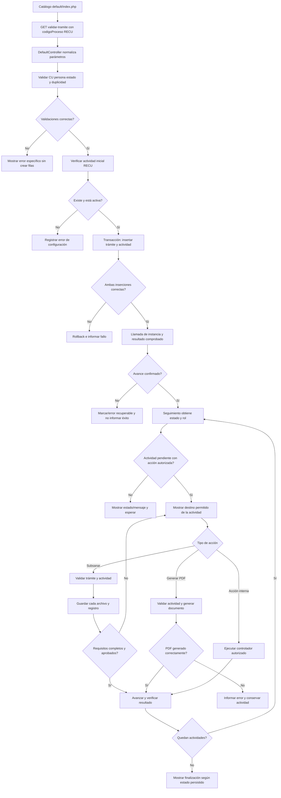

# RECU: propuesta de mejora del código (TO-BE)

**Documento complementario del AS-IS:** [regularizacion-carnet-universitario.md](regularizacion-carnet-universitario.md).  
**Objetivo:** proponer una secuencia PHP coherente y verificable para que el botón permita iniciar RECU, el seguimiento lleve a acciones reales y los resultados de cada paso se informen correctamente.

> Esta es una propuesta de implementación, no una descripción del código actual ni de reglas aprobadas por negocio. Los requisitos exactos, roles, mensaje al estudiante y decisión final sobre regularización deben confirmarse con el área responsable antes de programarse.

## Resultado esperado

1. El botón del catálogo llega a una validación que recibe sus datos por GET y no depende de un POST inexistente.
2. Si el CU es provisional, no hay RECU vigente y existe una actividad inicial, el servidor crea el trámite y actividad en una operación consistente.
3. El servidor informa éxito únicamente si el alta y el avance requerido tuvieron éxito.
4. Cada actividad de RECU queda asociada explícitamente a su controlador/acción; carga y PDF no se consideran conectados solo por existir como acciones genéricas.
5. La pantalla de seguimiento indica el estado real y ofrece la acción correcta según rol y actividad.
6. Los errores y resultados se pueden cubrir con pruebas de controlador, modelo y consulta/configuración.

## Propuesta paso a paso

### 1. Definir un contrato único de inicio

Mantener la URL del catálogo como GET y pasar `codigoProceso` e `inicio` en la ruta. En `actionValidarTramite()`, usar parámetros de acción/request para esos valores y reservar `$data` para los campos de un POST real. En `iniciarTramite()`, no leer claves de `$data` hasta verificar que sea un arreglo y que la clave exista; la observación específica de CRAE solo se procesa en esa rama.

Evitar que el mismo proceso se derive unas veces de `$codigoProceso` y otras de `$data['codigoProceso']`. El código de proceso validado debe ser el mismo que se guarda en ambas tablas.

### 2. Hacer determinista la validación

Orden sugerido:

1. Validar autenticación, CU e `IdPersona`.
2. Consultar una sola vez el registro `Universitarios` y determinar el estado efectivo, conservando claramente la regla de fecha existente.
3. Rechazar si el estado no cumple la regla de RECU.
4. Comprobar que no exista una instancia RECU vigente.
5. Comprobar que la actividad inicial configurada exista y esté activa.
6. Devolver un error específico y registrado si alguna validación falla.

Mantener las consultas parametrizadas y evitar concatenar CU/código de proceso en condiciones SQL.

### 3. Crear trámite y actividad de forma atómica

En `iniciarTramite()`:

- Usar la actividad inicial recuperada de `FL_ProcesosActividades`.
- Iniciar una transacción antes de insertar `FL_TramitesPersonas` y `FL_ActividadesTramitesPersonas`.
- Tomar `IdTramite` directamente del modelo recién insertado, no volver a consultar “el trámite más reciente de la persona”.
- Guardar ambas filas y confirmar la transacción solo si todas las operaciones requeridas terminan bien; revertir en caso de excepción.
- No ejecutar un comando vacío cuando no hay SQL auxiliar.
- Llamar al avance mediante una instancia de `FLActividadesTramitesPersonas`, ya que `avanzarFlujo()` no está declarado estático.
- Comprobar el valor devuelto. No convertir un `goHome()` en señal de éxito del alta; devolver un resultado explícito, por ejemplo `success`, `idTramite`, `error`.

Debe acordarse si el avance inicial pertenece a la misma transacción. Si el procedimiento no comparte conexión/transaction, definir compensación o persistencia de un estado de error para evitar dejar trámites parcialmente iniciados.

### 4. Conectar cada actividad de RECU a su acción

Definir y documentar los destinos de actividad como parte de la configuración funcional. El destino puede seguir siendo `FL_ProcesosActividades.Datos`, pero debe validarse para RECU en despliegue y probarse con una consulta de configuración.

- Actividad que solicita corrección: apuntar a `TramitesController::actionSubirDocumentos()` con `codigoProceso=RECU` e `idTramite`.
- Actividad de emisión de solicitud: apuntar a `TramitesController::actionImprimirSolicitud()` con los mismos parámetros.
- Actividades internas: asignar roles, mensaje, etiqueta y acción coherentes.

Si se desea evitar dependencia en rutas editables por base de datos, crear en PHP una tabla de rutas permitidas para RECU y validar `Datos` contra esa lista. No aceptar rutas arbitrarias desde configuración sin validación de acceso.

### 5. Asegurar la carga documental

Para la ruta RECU:

- Verificar que `idTramite` pertenezca al CU/proceso de la sesión y que la actividad permita carga.
- Consultar requisitos de la actividad vigente, no solo los requisitos de todo el proceso, si esa es la regla deseada.
- Mostrar todos los requisitos pendientes; en el código actual de carga se usa `queryOne()`, por lo que se debe confirmar y posiblemente cambiar a `queryAll()` si la vista presenta una lista.
- Validar que el archivo se guardó correctamente antes de registrar el nombre en `FL_TramitesRequisitosPersonas`.
- Evitar eliminar automáticamente archivos verificados/no verificados sin política explícita; mostrar el motivo y conservar trazabilidad.
- Avanzar solo cuando todos los requisitos aplicables estén registrados y aprobados según los criterios acordados.
- Registrar quién verificó, cuándo y el resultado de ventanilla.

### 6. Asegurar la acción PDF

En `actionImprimirSolicitud()`:

- Comprobar que el trámite existe, corresponde a `RECU`, pertenece al usuario o rol autorizado y tiene una actividad pendiente apta para impresión.
- Manejar ausencia de actividad pendiente en lugar de desreferenciar `null`.
- Generar el PDF y avanzar solo conforme al comportamiento esperado por negocio. Si la descarga falla, no avanzar el flujo antes de que el documento haya sido generado correctamente.
- No actualizar `Universitarios.CodigoEstadoCU` en esta acción salvo que esa responsabilidad se asigne expresamente a esta etapa y exista autorización funcional.

### 7. Informar el estado de forma veraz

`actionValidarTramite()` debe mostrar “solicitud registrada” solo después de confirmar alta y resultado de transición. Si el trámite se crea pero la actividad no avanza, mostrar un mensaje de estado pendiente/error y permitir recuperar la operación sin duplicar el trámite.

En el tablero, distinguir:

- estado general de `FL_TramitesPersonas`;
- estado de cada actividad de `FL_ActividadesTramitesPersonas`;
- acción disponible para el rol;
- mensaje de estudiante y proveído;
- finalización real del flujo.

El estado final y cualquier cambio de `Universitarios.CodigoEstadoCU` requieren una decisión funcional explícita. Si otra área o sistema actualiza el CU, el seguimiento debe mostrarlo sin atribuir esa operación a la acción PDF.

## Cambios propuestos por componente

| Componente | Propuesta TO-BE |
|---|---|
| `modules/Tramites/views/default/index.php` | Conservar enlace GET actual; añadir prueba que compruebe ruta y parámetros RECU. |
| `DefaultController::actionIndex()` | Retirar consulta de título de valores fijos y proteger consultas opcionales; el catálogo no debe depender de una fila ajena al usuario. |
| `DefaultController::actionValidarTramite()` | Normalizar parámetros de ruta/POST, validar en orden y devolver resultado fiel del inicio. |
| `DefaultController::iniciarTramite()` | Proteger datos opcionales, usar ID recién insertado, transacción, evitar SQL vacío, llamar método de instancia y comprobar el avance. |
| `FLActividadesTramitesPersonas::avanzarFlujo()` | Mantener llamada de instancia; manejar trámite/actividad/rol inexistentes antes de dereferenciarlos y propagar errores de forma controlada. |
| `siteDAO::formatearTramites()` | Construir botón solo para actividad autorizada y destino permitido; asegurar que el enlace pase los parámetros requeridos. |
| `TramitesController::actionSubirDocumentos()` y `TramitesDao` | Validar propiedad/actividad, enumerar todos los requisitos y avanzar solo al cumplir la política de revisión. |
| `TramitesController::actionImprimirSolicitud()` | Validar entrada/actividad y generar PDF sin avance prematuro ni acceso a una actividad nula. |
| Pruebas | Cubrir acceso por GET, estado no provisional, trámite duplicado, ausencia de actividad inicial, error de inserción, error de avance, carga incompleta/completa, rol incorrecto y PDF. |

## Diagrama propuesto TO-BE

El diagrama representa las responsabilidades PHP propuestas. Los destinos concretos, roles, requisitos, mensajes y condición de cierre deben acordarse y validarse en la configuración del proceso; no están codificados íntegramente en las vistas/controladores actuales.

## Criterios de aceptación

- El clic desde el catálogo llega por GET y no produce advertencias por `$data` nulo.
- Un CU que no cumple la regla de estado recibe mensaje y no crea registros.
- Un RECU vigente impide la duplicación.
- Una falla al guardar trámite/actividad revierte la operación o deja un estado recuperable y trazable.
- El mensaje de éxito aparece solo después de verificar las operaciones requeridas.
- Cada acción visible de RECU corresponde a un destino permitido, con rol y parámetros correctos.
- No se avanza con requisitos incompletos ni se avanza antes de producir el PDF requerido.
- El seguimiento permite distinguir trámite activo, actividad pendiente/despachada/rechazada y finalización.
- Las pruebas cubren el flujo desde el botón hasta el resultado mostrado.
